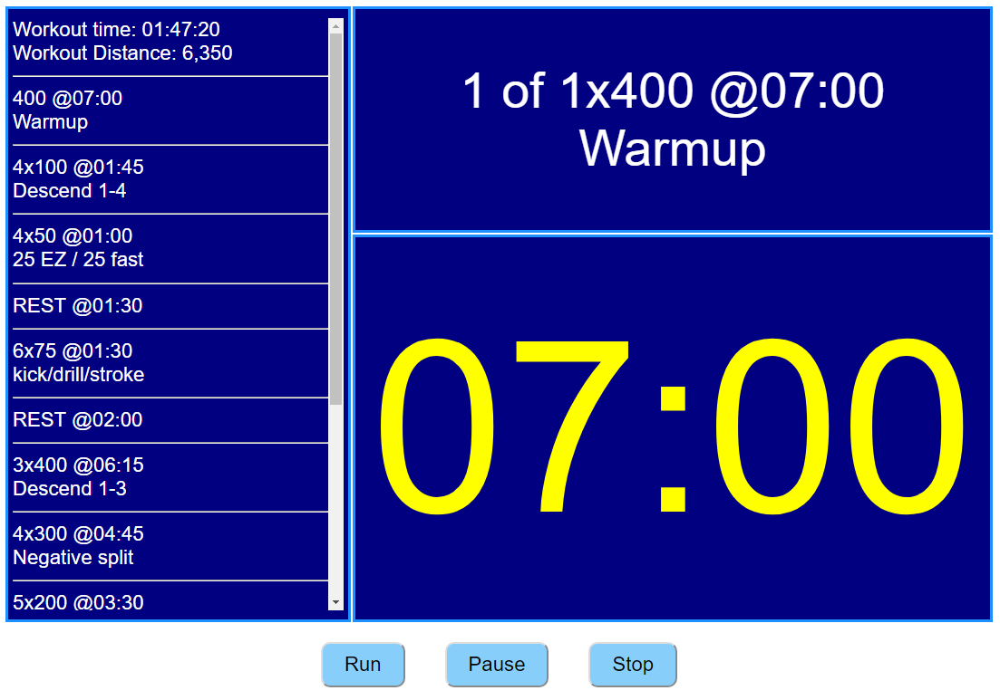
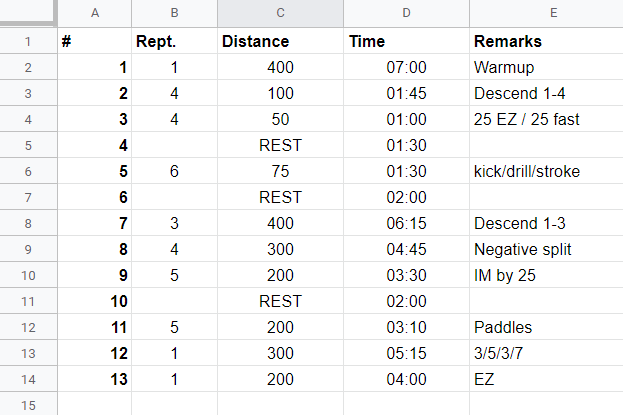
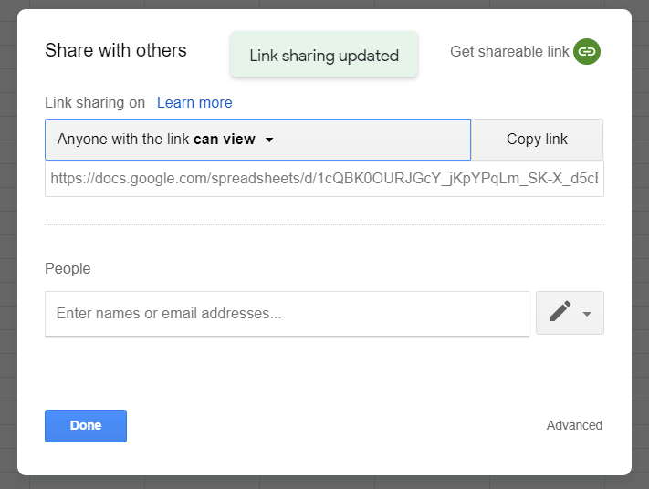

# swimming-workout-assistant
No more messy whiteboard and calculation in module 60.
Run your swimming workout smoothly with one screen that include everything.

## Prerequisites
### HTML+Javascript
Any web server

### Python
None.
Graphical User Interfaces base on Tkinter.
Tkinter is the Python interface to the Tk GUI toolkit shipped with Python.

## Installing and Running
### HTML+Javascript
Copy the files to your web server.
In the javascript file, change the variable "sheetURL" to your Google Sheet link.

Open `workout.html`

### Python
Change the variable "SHEET_NAME" to your Google Sheet link.

Run `python3 runWorkout.py`

## Writing the workout in Google sheets
Sheets Columns:
1. \# - Sequential Number. will be ignore by the software.
2. Rept - Number of time the distance will be swim. must by a number or empty. empty will consider as \1.
3. Distance - The distance to swim or can be any instruction, like rest between sets.
4. Time - Time of each interval. MUST be in MM:SS format.
5. Remarks - Instruction and emphasis from the coach.

### Share the sheet and the your link

Minimum permission nedded is "Anyone with link can view". 
Use the "Copy link" button and delete the "/edit?usp=sharing"

## To Do
1. Setting Screen
2. Load diffrent workout
